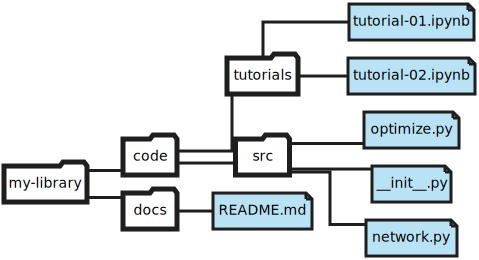

# My Python library

[]()

This repository contains my new Python library! For more information, contact @kamilazdybal.

Click here to access [web documentation]().

## Installation

Follow these instructions:

```
git clone https://github.com/kamilazdybal/my-library.git
cd my-library
python setup.py install
```

If the installation was successful, you should be able to run the unit tests:

```
python -m unittest discover
```

and Python should now allow you to:

```
import mylibrary
```

## Directory structure



## Local documentation build

To build the documentation locally first install the required libraries:

```
pip install sphinx
pip install jupyter-sphinx-theme
```

and then build the documentation:

```
cd docs
sphinx-build -b html . builddir
make html
```

To view the documentation in your web browser:

```
open _build/html/index.html
```